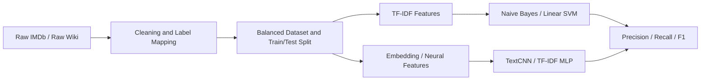

# 基于传统模型与神经网络模型的电影类型主题分类

**课程：** DTS406 Natural Language Processing  
**小组：** Group AA  
**成员：** Zijie Xue (2575576), Fengyuan Shu (2575904), Junyu Zhou (2575771)  
**日期：** 2026 年 5 月 19 日

## 摘要

本报告研究文档主题分类任务，并以电影类型分类作为实验场景。我们使用两个不同风格的电影文本数据集：IMDb 短剧情简介和 Wikipedia 长电影剧情。为了公平比较，两个数据集都被映射到同一组 11 个电影类型标签。我们构建了完整的 Python 分类流程，包括数据清洗、分词、停用词去除、词形还原、标签映射、类别采样、特征提取、模型训练和评估。实验比较了四种模型：Multinomial Naive Bayes、Linear SVM、TextCNN 和 TF-IDF MLP。结果显示，在 IMDb 数据集上，TF-IDF MLP 的表现最好；在 Wikipedia 数据集上，Linear SVM 的表现最好。这说明传统 TF-IDF 方法在电影类型分类中仍然很强，因为电影类型往往和关键词高度相关。神经网络模型有一定作用，但要超过强传统基线，需要合适的数据规模和特征设计。

## 1. 个人文献综述

### 1.1 Zijie Xue：应用场景与实际挑战

文档主题分类是指根据文本内容，将文档分配到一个或多个预先定义好的主题类别中。Sebastiani 将其描述为自动文本分类中的核心任务，即用机器学习方法替代人工阅读和分类。实际应用中，当文档数量过多、人力难以处理时，主题分类非常有用。

主题分类有很多落地场景。第一，新闻网站会把文章分成政治、体育、财经、科技、娱乐等类别，方便读者查找内容。第二，学术数据库会按照研究方向对论文进行分类，用于搜索和推荐。第三，社交媒体和客服系统会把帖子、评论或工单分类为投诉、退款、安全问题、产品反馈等主题。我们的电影类型分类任务与这些应用类似：每一段电影简介或剧情就是一个文档，电影类型就是主题标签。

这个任务面临几个主要挑战。第一个挑战是标签含义有重叠。比如一部电影可能既是 comedy 又是 romance，也可能既是 horror 又是 thriller。如果数据集强制使用单一标签，即使模型预测得有一定道理，也可能被判错。第二个挑战是类别不均衡。在我们的处理后数据中，`musical` 等类别样本较少，而 `drama` 等类别更常见。类别不均衡会影响 macro-F1，因为小类别也会被平等计入最终指标。第三个挑战是文本风格差异。IMDb 简介较短，宣传性和情绪色彩更强；Wikipedia 剧情更长，更像客观叙事。一个适合短文本的方法，不一定同样适合长文本。

因此，一个好的分类系统不应只追求准确率，还需要能适应不同文本长度、不同写作风格和不同标签分布。这也是本项目使用两个数据集而不是只使用一个数据集的原因。

实际系统还需要一定可解释性。如果一部电影被预测为 horror，用户可能希望知道模型是因为 `ghost`、`haunted`、`killer` 等词做出了判断。传统 TF-IDF 模型在这方面有一定优势，因为它的特征更容易被人理解。神经网络模型虽然表达能力更强，但解释起来更困难。对于课程作业来说，这也很重要，因为报告不仅要展示结果，还要解释结果产生的原因。

### 1.2 Fengyuan Shu：传统机器学习方法

传统文本分类通常先把文本转换成数值特征，然后再使用分类器。TF-IDF 是常见的文本特征表示方法。它会提高那些在某篇文档中频繁出现、但在整个语料中不是特别常见的词的权重。对于电影类型分类来说，这很有用，因为 `ghost`、`spaceship`、`murder`、`cowboy` 等词往往能强烈提示电影类型。

本项目使用的第一种传统方法是 Multinomial Naive Bayes。它简单、训练快，适合文本分类入门任务。它把文档看成词袋，并估计每个类别中不同词出现的概率。优点是效率高，在较小文本数据上也能取得不错效果。缺点是独立性假设太强，不理解词序和短语含义。例如，它很难真正区分 `not funny` 和 `funny`。

第二种传统方法是 Linear SVM。Joachims 的研究表明，SVM 很适合文本分类，因为文本通常具有大量高维稀疏特征。Linear SVM 试图找到一个具有较大间隔的线性决策边界。它的优点是在 TF-IDF 这类高维稀疏特征上表现稳定。缺点是它仍然主要依赖表层词特征，不能学习词向量或更深层语义结构。

因此，传统模型是非常强的基线。它们容易训练、容易复现，而且当标签高度依赖关键词时，经常很难被简单神经网络超过。在本项目中，Linear SVM 在 Wikipedia 长剧情数据上尤其强。

不过，传统模型也有局限。它们通常把文档看成无序特征集合。比如 `the hero is not afraid` 和 `the hero is afraid` 共享很多词，但含义不同。bigram TF-IDF 可以缓解一部分问题，但仍然无法完整建模剧情结构。在电影剧情中，事件顺序有时很重要：开头死亡可能是犯罪片设定，结尾揭露死亡可能是悬疑片反转。这也是我们仍然测试神经网络方法的原因。

### 1.3 Junyu Zhou：神经网络模型与特征学习

深度学习方法希望从数据中学习更有用的表示。词嵌入会把词表示成稠密向量，而不是稀疏 one-hot 特征。Mikolov 等人的研究表明，神经词向量可以捕捉词语之间的语义关系。在文本分类中，神经网络可以利用这些词向量学习局部模式或非线性特征组合。

本项目最终实验中的第一个神经模型是 TextCNN。Kim 的研究表明，卷积神经网络可以通过在词嵌入上应用卷积核来完成句子分类。在我们的任务中，TextCNN 可以学习 `haunted house`、`falls in love`、`serial killer` 等局部短语模式。它的优点是能捕捉局部 n-gram 信息；缺点是可能不擅长处理长距离剧情信息，特别是在 Wikipedia 长剧情中。

第二个神经模型是 TF-IDF MLP。它以 TF-IDF 特征作为输入，再使用多层感知机进行分类。它不是序列模型，但仍然是神经网络模型。它的优点是结合了强文本特征和非线性分类能力；缺点是不直接建模词序。我们也考虑过 LSTM 和 GRU 等循环模型。LSTM 用于缓解 RNN 的梯度消失问题，GRU 是一种更简单的门控循环单元。但在我们的实验中，循环模型不够稳定，原因可能是数据规模中等、词嵌入从零训练、长剧情中噪声较多。

总体来看，神经网络模型很有潜力，但不一定自动超过传统模型。它们的表现很依赖数据规模、输入表示和模型复杂度。

因此，本项目选择了一个较平衡的组合。TextCNN 作为典型深度文本分类模型，用于学习局部短语模式；TF-IDF MLP 作为第二个神经模型，用于学习加权词特征之间的非线性组合。

## 2. 数据集与预处理

### 2.1 数据来源

本项目使用两个公开 Kaggle 数据集。第一个是 **Genre Classification Dataset IMDb**，包含电影短剧情简介和类型标签。第二个是 **Wikipedia Movie Plots**，包含来自不同国家和电影产业的较长剧情文本。这两个数据集很适合对比，因为它们来自不同文本场景：IMDb 文本短、情绪强、宣传性强；Wikipedia 文本长、信息详细、叙事更客观。

| Dataset | Samples | Labels | Vocab | Avg. Length | Train | Test |
|---|---:|---:|---:|---:|---:|---:|
| IMDb | 10,550 | 11 | 40,586 | 55.71 | 8,440 | 2,110 |
| Wikipedia | 10,077 | 11 | 65,674 | 221.98 | 8,062 | 2,015 |

> 平均长度按 TF-IDF 版本清洗后的 token 数计算。

### 2.2 标签映射与数据清洗

两个原始数据集的标签体系不同。IMDb 的标签比较干净，基本是单一类型；Wikipedia 中有 `romantic drama`、`crime drama` 等复合标签，还有很多稀有标签。为了公平比较，我们把两个数据集都映射到同一组 11 个标签：

```text
drama, comedy, horror, action, thriller, romance, western,
crime, adventure, musical, science_fiction
```

其中，IMDb 的 `sci-fi` 被映射为 `science_fiction`。Wikipedia 中的复合类型按照优先级映射，较具体的标签如 horror、science fiction 优先于较宽泛的 drama。

主要清洗步骤包括：

- 删除空文本；
- 删除过短文本；
- 删除 Wikipedia 引用标记；
- 合并多余空格；
- 小写化；
- 分词；
- 去停用词；
- 词形还原；
- 按类别最多采样 1000 条；
- 按 80/20 做分层训练测试划分。

| Design Choice | Reason |
|---|---|
| 使用 11 个统一标签 | 保证 IMDb 和 Wikipedia 在同一分类任务下可比较。 |
| 删除 unknown 和无法映射的标签 | 减少噪声标签。 |
| 每类最多采样 1000 条 | 降低 drama、comedy 等大类的主导影响。 |
| 使用 80/20 分层划分 | 保持训练集和测试集标签比例接近。 |
| 神经模型使用 title + text_clean_tfidf | 标题含有类型信息，清洗文本能降低噪声。 |

处理后的数据仍然不是完全均衡的，因为部分类型在原始数据中数量不足。例如 IMDb 中 `musical` 只有 550 条，Wikipedia 中 `adventure`、`musical`、`science_fiction`、`western` 都少于 1000 条。这会影响 macro-F1，因为 macro 指标会平等看待每个类别。

## 3. 算法设计与实现

### 3.1 系统流程

系统使用 Python 实现。数据清洗脚本位于 `utils/`，训练脚本位于 `experiments/`。传统模型使用 scikit-learn，神经网络模型使用 PyTorch。所有模型使用同一份 train/test 划分，保证比较公平。



实现上，数据准备和实验训练是分离的。预处理脚本负责读取 IMDb 文本文件和 Wikipedia CSV 文件，完成标签映射并保存处理后的 CSV。分析脚本生成数据统计和词频表。后续所有模型都读取相同的 processed 文件，而不是各自重新划分数据。

### 3.2 模型伪代码

#### Multinomial Naive Bayes + TF-IDF

```text
FUNCTION TrainNaiveBayes(train_texts, train_labels):
    X_train = TFIDF(train_texts)
    model = MultinomialNB(alpha=0.5)
    FIT model on X_train and train_labels
    RETURN vectorizer, model

FUNCTION PredictNaiveBayes(vectorizer, model, test_texts):
    X_test = TRANSFORM test_texts with vectorizer
    RETURN PREDICT model on X_test
```

#### Linear SVM + TF-IDF

```text
FUNCTION TrainLinearSVM(train_texts, train_labels):
    X_train = TFIDF(train_texts, unigram_and_bigram=True)
    model = LinearSVM(class_weight="balanced")
    FIT model on X_train and train_labels
    RETURN vectorizer, model

FUNCTION PredictLinearSVM(vectorizer, model, test_texts):
    X_test = TRANSFORM test_texts with vectorizer
    RETURN PREDICT model on X_test
```

#### TextCNN

```text
FUNCTION TrainTextCNN(train_tokens, train_labels):
    vocab = BUILD_VOCAB(train_tokens)
    input_ids = ENCODE_AND_PAD(train_tokens)
    FOR each epoch:
        embeddings = LOOKUP(input_ids)
        feature_maps = CONVOLVE embeddings with filter sizes 1,2,3,4,5
        pooled = MAX_POOL(feature_maps)
        logits = Linear(Dropout(pooled))
        UPDATE model using cross entropy loss
    RETURN model, vocab
```

#### TF-IDF MLP

```text
FUNCTION TrainTfidfMLP(train_texts, train_labels):
    X_train = WORD_AND_CHAR_TFIDF(train_texts)
    model = MLP(input_dim, hidden_dim=1024, output_dim=num_labels)
    FOR each epoch:
        logits = model(X_train)
        UPDATE model using cross entropy loss with label smoothing
    RETURN vectorizer, model
```

### 3.3 模型优缺点

| Model | Input | Advantage | Weakness |
|---|---|---|---|
| Naive Bayes | TF-IDF words | 速度快，简单，适合关键词明显的数据。 | 独立性假设强，不理解短语关系。 |
| Linear SVM | TF-IDF words/bigrams | 适合高维稀疏文本特征，结果稳定。 | 仍然依赖表层特征，不学习语义表示。 |
| TextCNN | Token ids and embeddings | 能学习局部 n-gram 模式。 | 需要足够数据和较好 embedding，长文本上不稳定。 |
| TF-IDF MLP | Word and char TF-IDF | 结合强特征和神经网络非线性。 | 不直接建模词序和剧情结构。 |

## 4. 实验结果分析

### 4.1 主实验结果

本项目使用 macro precision、macro recall 和 macro-F1 作为主要评价指标。由于类别并不完全均衡，macro 指标比单纯 accuracy 更能反映小类别表现。

| Dataset | Model | Accuracy | Macro Precision | Macro Recall | Macro F1 |
|---|---:|---:|---:|---:|---:|
| IMDb | Naive Bayes | 0.5649 | 0.5905 | 0.5485 | 0.5404 |
| IMDb | Linear SVM | 0.5673 | 0.5623 | 0.5709 | 0.5648 |
| IMDb | TextCNN | 0.5441 | 0.5478 | 0.5471 | 0.5334 |
| IMDb | TF-IDF MLP | **0.5682** | 0.5831 | 0.5677 | **0.5706** |
| Wikipedia | Naive Bayes | 0.5390 | 0.5766 | 0.5221 | 0.4991 |
| Wikipedia | Linear SVM | **0.5965** | **0.5890** | **0.6051** | **0.5944** |
| Wikipedia | TextCNN | 0.5270 | 0.5516 | 0.5302 | 0.5248 |
| Wikipedia | TF-IDF MLP | 0.5792 | 0.5831 | 0.5871 | 0.5812 |

### 4.2 结果解释

在 IMDb 数据集上，TF-IDF MLP 的 macro-F1 最高。IMDb 文本较短，而且类型关键词比较明显，因此 TF-IDF 特征非常有效。MLP 可以在这些强特征基础上学习一些非线性关系，因此略微超过 Linear SVM。

在 Wikipedia 数据集上，Linear SVM 表现最好。Wikipedia 剧情很长，包含大量人物名、事件和支线剧情。TF-IDF 可以在长文本中突出重要词，而 SVM 对高维稀疏特征非常稳定。TF-IDF MLP 的表现也接近 SVM，但略低，可能是因为神经网络对某些稀疏模式产生了过拟合。

TextCNN 在两个数据集上都弱于 SVM。这不代表 CNN 不适合文本分类，而是说明在本项目设置下，TextCNN 需要从零学习词嵌入，数据量又不算特别大。模型需要同时学习词语含义和分类边界，难度较高。Wikipedia 长剧情还会带来更多噪声，使局部卷积特征不够稳定。

Naive Bayes 在 IMDb 上还算有竞争力，但在 Wikipedia 上更弱。它的简单词频假设更适合短文本，而不太适合长剧情。Linear SVM 更稳定，因为它能处理大量稀疏特征，并使用 margin-based 的决策边界。

Precision、Recall 和 F1 的含义也不同。Precision 衡量模型预测为某一类时有多少是正确的；Recall 衡量真实属于某一类的样本有多少被找回；F1 平衡二者。在本任务中，macro recall 和 macro-F1 很重要，因为模型可能通过预测常见类别得到不错 accuracy，但忽略小类别。例如 musical 可能被误判为 drama 或 romance，因为很多 musical 剧情本身也有情感线。

### 4.3 误差来源

主要误差来源包括四点。

第一，电影类型本身不是完全互斥的。一部电影可能同时像 thriller、horror 和 crime。第二，Wikipedia 的 genre 字段较乱，很多是复合标签。虽然我们使用了优先级映射，但单标签分类无法完全表达多类型电影。第三，两个数据集写作风格差异较大。IMDb 更像宣传简介，Wikipedia 更像完整剧情。第四，部分类别样本仍然不足，比如 musical、western 等类别，这会降低 macro-F1。

实验也说明，深度学习不一定天然优于传统模型。复杂模型如果没有足够数据或预训练词向量，可能不如简单稳定的 TF-IDF + SVM。TF-IDF MLP 的表现较好，是因为它结合了强特征工程和神经网络分类器。

### 4.4 可复现性

所有输出表格都由项目文件生成。清洗数据保存在：

```text
data/processed/
```

数据统计保存在：

```text
outputs/tables/
```

模型结果保存在：

```text
outputs/results/
```

最终对比表为：

```text
outputs/results/model_comparison.csv
```

深度学习环境使用 PyTorch CUDA 12.6。本项目脚本设置了随机种子，因此在相同软件环境下重复运行时，结果应基本接近。

## 5. 结论

本项目在两个电影文本数据集上实现了完整的文档主题分类系统。实验表明，数据风格对模型表现有明显影响。IMDb 短简介和 Wikipedia 长剧情的分类难度不同。传统 TF-IDF 模型仍然很强，尤其是 Linear SVM。神经网络模型也有价值：TextCNN 提供了标准深度文本分类基线，TF-IDF MLP 展示了强特征工程和神经网络结合的效果。但深度学习并不一定自动更好。对于中等规模、类别不完全均衡、关键词信号很强的数据，传统方法仍然可能是最可靠的选择。

## 参考文献

1. Sebastiani, F. *Machine Learning in Automated Text Categorization*. ACM Computing Surveys, 2002. https://doi.org/10.1145/505282.505283
2. Joachims, T. *Text Categorization with Support Vector Machines*. ECML, 1998. https://doi.org/10.1007/BFb0026683
3. Kim, Y. *Convolutional Neural Networks for Sentence Classification*. arXiv, 2014. https://arxiv.org/abs/1408.5882
4. Cho, K. et al. *Learning Phrase Representations using RNN Encoder--Decoder*. arXiv, 2014. https://arxiv.org/abs/1406.1078
5. Mikolov, T. et al. *Efficient Estimation of Word Representations in Vector Space*. arXiv, 2013. https://arxiv.org/abs/1301.3781
6. Ramos, J. *Using TF-IDF to Determine Word Relevance in Document Queries*. 2003. https://citeseerx.ist.psu.edu/document?doi=b3bf6373ff41a115197cb5b30e57830c16130c2c
7. Hochreiter, S. and Schmidhuber, J. *Long Short-Term Memory*. Neural Computation, 1997. https://doi.org/10.1162/neco.1997.9.8.1735
8. IMDb Genre Classification Dataset. Kaggle. https://www.kaggle.com/datasets/hijest/genre-classification-dataset-imdb
9. Wikipedia Movie Plots. Kaggle. https://www.kaggle.com/datasets/jrobischon/wikipedia-movie-plots
