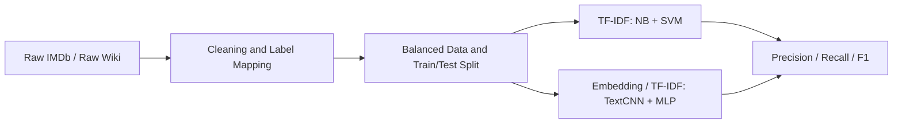

# 基于传统模型与神经网络模型的电影类型主题分类

**课程：** DTS406 Natural Language Processing  
**小组：** Group AA  
**成员：** Zijie Xue (2575576), Fengyuan Shu (2575904), Junyu Zhou (2575771)  
**提交日期：** 2026 年 5 月 19 日

## 目录

1. 个人文献综述  
2. 数据集与预处理  
3. 算法设计与实现  
4. 实验结果分析  
5. 结论  
6. 参考文献

## 1. 个人文献综述

### 1.1 Zijie Xue：面向用户的文档组织

文档主题分类是根据文本内容，将文档分配到预先定义好的主题类别中。Sebastiani 将它描述为自动文本分类中的核心任务之一。站在用户角度看，主题分类的主要目标是让大量文本更容易搜索、浏览和管理。常见应用包括新闻网站自动把文章分到不同栏目、在线客服系统把工单分配给对应团队，以及电影平台按照类型组织影片。

这个任务有三个主要挑战。第一，主题边界经常不清晰。例如一部电影可以同时属于 thriller 和 crime。第二，标签分布可能不均衡，模型容易学好大类而忽略小类。第三，不同平台的文本风格差异很大。IMDb 简介通常更短、更有情绪和宣传性，而 Wikipedia 剧情更长、更客观、更像百科叙事。

传统方法如 Naive Bayes 和 Linear SVM 很有用，因为它们训练快，并且和 TF-IDF 关键词特征配合得很好。它们的弱点是基本忽略词序。深度学习方法如 TextCNN 和 TF-IDF MLP 可以学习局部短语模式或非线性特征组合，但它们需要更仔细的调参，也更难解释。

### 1.2 Fengyuan Shu：特征表示与算法

文档主题分类也可以看作一个特征表示问题：系统必须先把词转换成数值信号，再进行预测。TF-IDF 是常用方法，因为它会提高那些在某篇文档中重要、但在整个语料中不是到处都出现的词的权重。实际应用包括学术论文索引、法律文档分流和产品评论分类。

这个特征处理流程有三个困难。第一，同一主题可以用不同词表达，稀疏特征可能漏掉语义相似性。第二，噪声标签和复合标签会让训练数据不够干净。第三，长文档包含很多无关人物名和事件，可能掩盖真正有用的主题词。

Naive Bayes 会估计类别和词之间的概率关系，方法简单，但独立性假设很强。Linear SVM 很适合高维稀疏文本特征，通常能给出很强的基线，但它仍然基于表层特征。TextCNN 使用词嵌入和卷积核学习短语模式。TF-IDF MLP 保留强 TF-IDF 输入，同时加入神经网络的非线性能力。因此，这四种方法分别代表了两条传统路线和两条神经网络路线。

### 1.3 Junyu Zhou：模型行为与评价

从评价角度看，文档主题分类的任务是预测标签，并检查模型在所有类别上的预测是否可靠。它可以用于邮件过滤、社交媒体内容管理和数字图书馆组织。在本项目中，每段电影剧情是一个文档，电影类型就是主题标签。

这个任务的核心挑战不只是技术问题。第一，人工标签可能会把一个多主题文档简化成一个类别。第二，macro-F1 对小类别比较敏感，因为每个类别的权重相同。第三，训练集和测试集的写作风格可能不同，这会造成领域差异。

本项目选择的模型有不同特点。Naive Bayes 易于复现，但可能过度简化语言。Linear SVM 在 TF-IDF 特征上很稳健，也是关键词明显的数据集上很难击败的基线。TextCNN 可以从 token 序列中学习短语线索，但在中等规模数据上，如果词嵌入从零训练，效果可能不够强。TF-IDF MLP 是基于工程特征的神经模型；它不能完整建模词序，但可以学习 word 和 character TF-IDF 特征之间的有用组合。这使得最终比较不只是分数比较，也能体现不同建模思路的差异。

## 2. 数据集与预处理

### 2.1 数据来源

本项目使用两个公开 Kaggle 数据集。第一个是 **Genre Classification Dataset IMDb**，包含较短的电影简介和类型标签。第二个是 **Wikipedia Movie Plots**，包含来自不同国家和电影产业的较长剧情介绍。这两个数据集适合对比，因为它们来自不同文本场景：IMDb 文本短、情绪强、宣传性强；Wikipedia 文本长、信息更详细、叙事更客观。

| 数据集 | 样本数 | 标签数 | 词表大小 | 平均长度 | 训练集 | 测试集 |
|---|---:|---:|---:|---:|---:|---:|
| IMDb | 10,000 | 10 | 39,013 | 55.56 | 8,000 | 2,000 |
| Wikipedia | 9,601 | 10 | 64,454 | 225.47 | 7,680 | 1,921 |

平均长度按 TF-IDF 版本清洗后的 token 数计算。

### 2.2 清洗与标签映射

两个原始数据集的标签体系不同。IMDb 的标签更干净，多数是单一类型；Wikipedia 中存在 `romantic drama`、`crime drama` 等复合标签，也有很多稀有标签。为了公平比较，我们把两个数据集都映射到同一组 10 个共享标签：

```text
drama, comedy, horror, action, thriller, romance, western,
crime, adventure, science_fiction
```

其中，IMDb 的 `sci-fi` 被映射为 `science_fiction`。Wikipedia 的复合类型按优先级映射，并把 `adventure` 放在 `action` 前面，以减少复合标签中的 adventure 电影被 action 吸收的情况。

主要清洗步骤包括：删除空文本，删除过短文本，删除 Wikipedia 引用标记，合并多余空格，小写化，分词，去停用词，词形还原。脚本会保存两个文本字段：`text_clean_tfidf` 用于 TF-IDF，也用于最终神经序列输入；`text_clean_dl` 保留为更轻量的序列清洗版本，但最终报告使用 `text_clean_tfidf`，因为它能减少噪声并提高模型稳定性。

| 设计选择 | 原因 |
|---|---|
| 使用 10 个共享标签 | 保证 IMDb 和 Wikipedia 在同一个分类任务下可比较。 |
| 删除 unknown 和无法映射的标签 | 避免噪声标签影响训练。 |
| 每类最多采样 1000 条 | 降低 drama、comedy 等大类的主导影响。 |
| 使用分层 80/20 划分 | 保持训练集和测试集标签比例接近。 |
| 神经模型使用 title + cleaned text | 标题常包含类型线索，清洗文本能降低噪声。 |

处理后的数据接近平衡，但不是完全平衡。IMDb 删除一个过小类别后，每类都是 1000 条。Wikipedia 中 `adventure` 有 799 条，`science_fiction` 有 914 条，`western` 有 888 条，仍然少于 1000 条。这会影响结果解释：accuracy 可能看起来不错，但小类别表现较弱时，macro precision、macro recall 和 macro-F1 更能反映问题。

## 3. 算法设计与实现

### 3.1 系统流程

系统使用 Python 实现。数据清洗脚本放在 `utils/` 下，训练脚本放在 `experiments/` 下。传统模型使用 scikit-learn，神经网络模型使用 PyTorch。所有模型使用同一份 train-test 划分，保证比较公平。

预处理脚本读取 IMDb 原始文本文件和 Wikipedia CSV 文件，完成标签映射，写出两个处理后的 CSV 文件，并保存 split 列。分析脚本会生成数据统计和词频表。这样设计可以保证复现性：所有模型读取同样的 processed 文件，而不是各自重新划分数据。



### 3.2 选定模型

Naive Bayes 是一个快速的概率基线。文本先被转换为 TF-IDF 特征，分类器再估计不同词在不同电影类型下出现的概率。下面的伪代码展示了它的两个核心步骤：特征提取和概率预测。

```text
FUNCTION TrainNaiveBayes(train_texts, train_labels):
    X_train = TFIDF(train_texts)
    model = MultinomialNB(alpha=0.5)
    FIT model on X_train and train_labels
    RETURN vectorizer, model

FUNCTION PredictNaiveBayes(vectorizer, model, test_texts):
    X_test = TRANSFORM test_texts with vectorizer
    RETURN PREDICT model on X_test
```

Linear SVM 是第二个传统方法。它使用 TF-IDF unigram 和 bigram 特征，然后学习一个大间隔线性决策边界。这适合稀疏文本向量，因为很多类型线索会以关键词或短语形式出现。

```text
FUNCTION TrainLinearSVM(train_texts, train_labels):
    X_train = TFIDF(train_texts, unigram_and_bigram=True)
    model = LinearSVM(class_weight="balanced")
    FIT model on X_train and train_labels
    RETURN vectorizer, model

FUNCTION PredictLinearSVM(vectorizer, model, test_texts):
    X_test = TRANSFORM test_texts with vectorizer
    RETURN PREDICT model on X_test
```

TextCNN 是第一个深度学习模型。它读取 token ids，查找词嵌入，并在局部词窗口上使用卷积核。max-pooling 会保留每个卷积核最强的短语信号。这对应了卷积网络在文本分类中的常见用法，包括 word-level CNN 和 character-level CNN。

```text
FUNCTION TrainTextCNN(train_tokens, train_labels):
    vocab = BUILD_VOCAB(train_tokens)
    input_ids = ENCODE_AND_PAD(train_tokens)
    FOR each epoch:
        embeddings = LOOKUP(input_ids)
        feature_maps = CONVOLVE embeddings with filter sizes 1,2,3,4,5
        pooled = MAX_POOL(feature_maps)
        logits = Linear(Dropout(pooled))
        UPDATE model using cross entropy loss
    RETURN model, vocab
```

TF-IDF MLP 是第二个深度学习模型。它不直接读取 token 序列，而是把 word 和 character TF-IDF 特征作为输入，再使用多层感知机进行分类。这个设计保留了强关键词特征，同时加入神经网络的非线性分类能力。

```text
FUNCTION TrainTfidfMLP(train_texts, train_labels):
    X_train = WORD_AND_CHAR_TFIDF(train_texts)
    model = MLP(input_dim, hidden_dim=1024, output_dim=num_labels)
    FOR each epoch:
        logits = model(X_train)
        UPDATE model using cross entropy loss with label smoothing
    RETURN vectorizer, model
```

### 3.3 模型优劣势

Naive Bayes 很快、很简单，但它假设词之间相互独立。Linear SVM 在稀疏 TF-IDF 特征上很强，但不学习语义嵌入。TextCNN 可以学习局部短语模式，但需要足够训练样本和较好的词嵌入。TF-IDF MLP 使用强 TF-IDF 特征并学习非线性组合，但它仍然不能直接理解词序。

最终四个模型覆盖了不同建模思路。Naive Bayes 是概率基线。Linear SVM 是强 margin-based 传统基线。TextCNN 是基于 embedding 的神经模型，直接读取 token 序列。TF-IDF MLP 是基于工程文本特征的神经分类器。因此，这个实验不只是比较分数，也是在比较关键词特征、局部短语学习和非线性神经分类在电影类型预测中的作用。

| 模型 | 输入 | 主要优点 | 主要弱点 |
|---|---|---|---|
| Naive Bayes | TF-IDF words | 训练很快、简单，适合关键词明显的数据。 | 独立性假设强，短语理解弱。 |
| Linear SVM | TF-IDF words/bigrams | 适合高维稀疏文本特征，结果稳定。 | 仍然依赖表层特征，不学习语义表示。 |
| TextCNN | Token ids and embeddings | 可以从文本中学习局部 n-gram 模式。 | 需要足够数据和较好 embedding，在长噪声文本上不够稳定。 |
| TF-IDF MLP | Word and character TF-IDF | 结合强特征和神经网络非线性。 | 不直接建模词序或完整剧情结构。 |

## 4. 实验结果分析

### 4.1 主要结果

本项目报告 macro precision、macro recall 和 macro-F1，因为数据集并不完全平衡。Macro 指标会平等看待每个类别，因此小类别表现较弱时也会体现出来。

| 数据集 | 模型 | Accuracy | Macro Precision | Macro Recall | Macro F1 |
|---|---|---:|---:|---:|---:|
| IMDb | Naive Bayes | **0.5935** | 0.5952 | **0.5935** | 0.5864 |
| IMDb | Linear SVM | 0.5925 | 0.5870 | 0.5925 | **0.5878** |
| IMDb | TextCNN | 0.5410 | 0.5437 | 0.5410 | 0.5377 |
| IMDb | TF-IDF MLP | 0.5885 | **0.5956** | 0.5885 | 0.5849 |
| Wikipedia | Naive Bayes | 0.5757 | 0.5832 | 0.5776 | 0.5629 |
| Wikipedia | Linear SVM | 0.5836 | 0.5818 | 0.5889 | 0.5834 |
| Wikipedia | TextCNN | 0.5450 | 0.5703 | 0.5512 | 0.5491 |
| Wikipedia | TF-IDF MLP | **0.5872** | **0.5903** | **0.5930** | **0.5895** |

### 4.2 训练曲线与混淆矩阵

下面的训练曲线展示了两个深度学习模型在两个数据集上的训练 loss。TF-IDF MLP 曲线较短，是因为 early stopping 在验证集表现不再提升时提前停止训练。


验证集 macro-F1 曲线说明，训练 loss 持续下降并不一定代表泛化能力持续提升。TextCNN 的训练 loss 会继续下降，但验证 macro-F1 可能上下波动。TF-IDF MLP 较早达到较好验证分数，因此 early stopping 可以防止它过度拟合训练集。


下面两张混淆矩阵展示了代表性结果：IMDb 上的 Linear SVM，以及 Wikipedia 上的 TF-IDF MLP。


### 4.3 结果解释

在 IMDb 数据集上，Linear SVM 的 macro-F1 略高，Naive Bayes 的 accuracy 最高，TF-IDF MLP 的 macro precision 最高。IMDb 文本较短，且类型词通常很明显，所以 TF-IDF 特征对三个 TF-IDF 相关模型都很有效。Naive Bayes、Linear SVM 和 TF-IDF MLP 之间的差距很小，说明清洗后的 IMDb 任务主要由清晰的关键词证据驱动。

在 Wikipedia 数据集上，TF-IDF MLP 表现最好。Wikipedia 剧情很长，包含大量混合事件、人物名和支线情节。TF-IDF 能在长文本中突出重要词，而 MLP 可以学习 word 和 character TF-IDF 特征之间的非线性组合，因此略微超过 Linear SVM。不过，长剧情中也有很多对类型分类不直接有用的人名和事件，这限制了进一步提升。

TextCNN 在两个数据集上都低于 TF-IDF 相关模型。这不代表 CNN 不适合文本分类，而是说明在本项目设置下，embedding 是从零训练的，数据规模也只是中等。模型需要在同一批有限数据上同时学习词义和分类边界，难度较高。另外，Wikipedia 仍然不是完全平衡：adventure、science fiction 和 western 都少于 1000 条。Macro-F1 会平等计算每个类别，因此小类别表现差会更明显地影响最终分数。

Naive Bayes 在 IMDb 上有竞争力，但在 Wikipedia 上较弱。它的简单词频假设更适合短宣传简介，不太适合长剧情。Linear SVM 更稳定，因为它能处理大量稀疏特征，并使用 margin-based 决策边界。混淆矩阵也显示，很多错误发生在语义接近的类型之间。例如 action 和 adventure 容易重叠，thriller、horror 和 crime 也会共享相似剧情词。

Precision、recall 和 F1 表达的含义不同。Precision 衡量模型预测为某一类时有多少是正确的。Recall 衡量真实属于某一类的样本有多少被找回。F1 平衡二者。在本任务中，macro recall 和 macro-F1 很重要，因为模型可能通过预测常见类别获得不错 accuracy，但仍然忽略小类别。例如 adventure 可能被误判为 action，因为很多电影同时包含动作场景和冒险旅程。

### 4.4 误差来源

主要误差来源有四点。第一，电影类型本身并不完全互斥。一部电影可能同时像 thriller、horror 和 crime。第二，Wikipedia 的 genre 字段比较 noisy，很多是复合标签。虽然我们使用了优先级映射，但单标签分类无法完整表达多类型电影。第三，两个数据集的写作风格差异较大。IMDb 更像宣传简介，Wikipedia 更像完整剧情。第四，一些类型在平衡后仍然样本不足。这些因素解释了为什么没有模型取得很高分数。

实验也说明，深度学习并不一定天然优于传统模型。TextCNN 试图从同一份中等规模训练数据中同时学习 embedding 和短语过滤器，而 TF-IDF MLP 从更强的文本表示开始，这种表示已经突出了重要词。因此，在本课程作业场景下，TF-IDF MLP 更稳定。未来如果使用预训练词向量或更大的带标签电影数据集，embedding-based 模型可能会进一步提升。

### 4.5 可复现性

所有输出表格都由项目文件生成。清洗后的数据保存在：

```text
data/processed/
```

数据统计保存在：

```text
outputs/tables/
```

模型报告和预测文件保存在：

```text
outputs/results/
```

最终对比表保存在：

```text
outputs/results/
model_comparison.csv
```

生成的图片保存在：

```text
outputs/figures/
```

深度学习环境使用本地 GPU 上的 PyTorch CUDA 12.6。由于脚本固定了随机种子，在相同软件版本下重新运行时，结果应该接近。不过 GPU 数值计算仍可能带来很小差异。

## 5. 结论

本项目在两个电影文本数据集上实现了完整的文档主题分类系统。结果表明，数据集风格会明显影响模型表现。短 IMDb 简介和长 Wikipedia 剧情有不同分类难点。传统 TF-IDF 模型依然很强，尤其是 Linear SVM。神经网络模型也有价值：TextCNN 提供了标准的深度文本分类基线，TF-IDF MLP 说明强特征工程和神经分类器结合也可以有效。不过，深度学习并不会自动更好。对于中等规模、标签不完全均衡、关键词信号很强的数据集，简单传统方法仍然可能是最可靠的选择。

## 6. 参考文献

1. Sebastiani, F. *Machine Learning in Automated Text Categorization*. ACM Computing Surveys, 2002. https://doi.org/10.1145/505282.505283
2. Joachims, T. *Text Categorization with Support Vector Machines: Learning with Many Relevant Features*. ECML, 1998. https://doi.org/10.1007/BFb0026683
3. Cortes, C. and Vapnik, V. *Support-Vector Networks*. Machine Learning, 1995. https://doi.org/10.1007/BF00994018
4. Kim, Y. *Convolutional Neural Networks for Sentence Classification*. arXiv, 2014. https://arxiv.org/abs/1408.5882
5. Zhang, X., Zhao, J. and LeCun, Y. *Character-level Convolutional Networks for Text Classification*. arXiv, 2015. https://arxiv.org/abs/1509.01626
6. Ramos, J. *Using TF-IDF to Determine Word Relevance in Document Queries*. 2003. https://citeseerx.ist.psu.edu/document?doi=b3bf6373ff41a115197cb5b30e57830c16130c2c
7. Genre Classification Dataset IMDb. Kaggle. https://www.kaggle.com/datasets/hijest/genre-classification-dataset-imdb
8. Wikipedia Movie Plots. Kaggle. https://www.kaggle.com/datasets/jrobischon/wikipedia-movie-plots
9. scikit-learn Documentation. https://scikit-learn.org/stable/
10. PyTorch Documentation. https://pytorch.org/docs/stable/index.html
